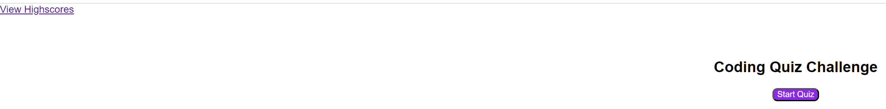
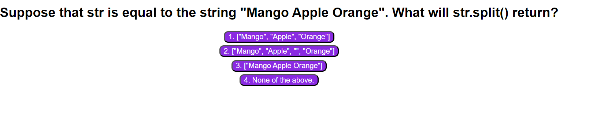
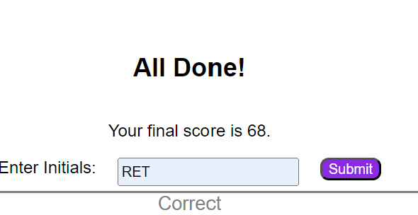
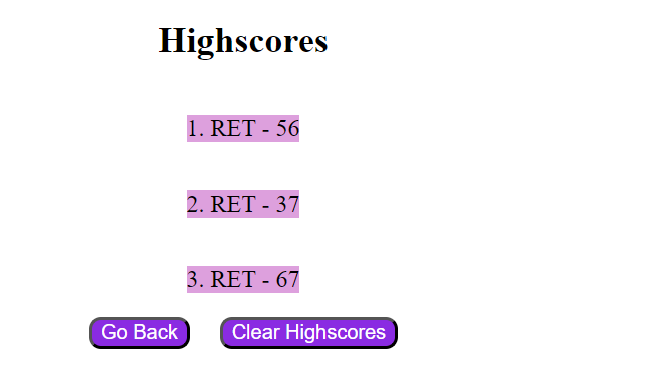

# Coding_Quiz_Challenge

## Description

Coding quiz, for job seekers, launches on a start page. When the user clicks on start quiz, a timer is initiated to start at 75 seconds. An array object is displayed with a question, an array of potential answers, and an array choice for an answer. The correct answer is stored in the object. If the answer is incorrect 15 seconds is deducted from the applicants score. Once the answer is submitted, the application iterates to the next question, until the end of the list of questions. At the completion of the quiz the user is prompted to enter initials of their name to submit the score obtained. The score is saved to local storage. The quiz can be attempted multiple times and the new scores will be saved to local storage. On the home page or the completion of a quiz, the user can view the high scores, which retrieves the data from local storage. Additionally, the applicant can clear all scores from local storage on the high scores page.

## Installation

N/A

## Usage

The applicant is presented with the Home Page to take an IT quiz to either start a quiz or view the high scores.

A quiz is launched for 75 seconds to assess the applicant with a multiple choice quiz. The applicant must try to answer four questions. If the answer is incorrect, 15 seconds are deducted from the applicants score.

At the completion of the quiz, the applicant can enter their initials, in order to save the current score.

The applicants can view their high scores.

GitHub Repository: https://github.com/rethomas67/Coding_Quiz_Challenge/
GitHub page link: https://rethomas67.github.io/Coding_Quiz_Challenge/

## Credits

N/A

## License

N/A
